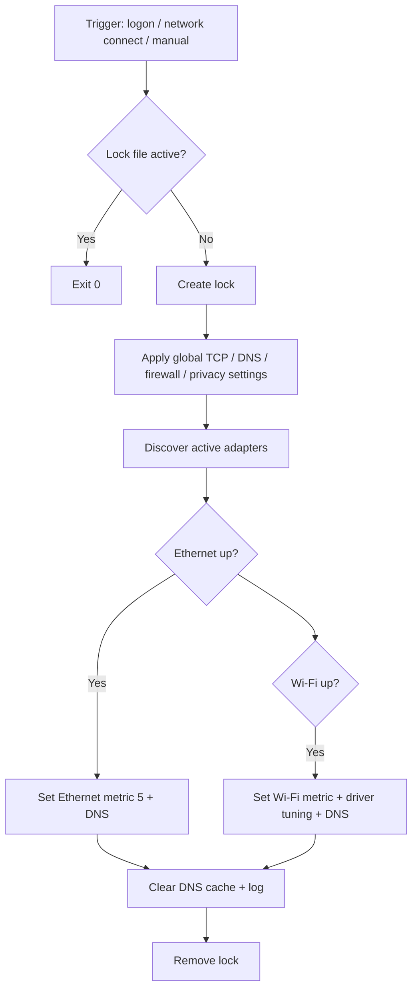

# NetForge for Windows

**Automatic network performance tuning and security hardening for Windows 10/11.**

[](LICENSE)
[](https://github.com/Pitchfork-and-Torch/netforge-windows)

NetForge discovers your active Ethernet and Wi-Fi adapters at runtime, applies DNS-over-HTTPS, TCP stack optimizations, adapter metrics, and optional hardening — then re-runs whenever you sign in or join a network. No router admin access required.

```
  Boot / Sign-in ──► Scheduled task (30s delay) ──► NetworkAuto.ps1
  Join Wi-Fi/LAN ──► Event trigger (10s delay)  ──► NetworkAuto.ps1
```

---

## Quick install

### Recommended — clone and install

Run **PowerShell as Administrator**:

```powershell
git clone https://github.com/Pitchfork-and-Torch/netforge-windows.git
cd netforge-windows
# Optional: read-only health report first
.\src\Get-NetForgeStatus.ps1
.\src\Install-NetworkAuto.ps1
```

### One-liner bootstrap

```powershell
irm https://raw.githubusercontent.com/Pitchfork-and-Torch/netforge-windows/main/install.ps1 | iex
```

Clones the repo to `%LOCALAPPDATA%\NetForge\repo` and runs the installer. **Review [install.ps1](install.ps1) before piping to `iex`** if you prefer to inspect first.

Tagged releases: [Releases](https://github.com/Pitchfork-and-Torch/netforge-windows/releases)

---

## What it does

| Area | Action |
|------|--------|
| **DNS** | Sets Cloudflare + Google resolvers on active adapters; enables DoH |
| **Routing** | Ethernet metric 5; Wi-Fi 10 (alone) or 50 (when Ethernet is up) |
| **TCP/UDP** | CTCP, RSS, RSC, Fast Open, ECN; disables timestamps where beneficial |
| **Wi-Fi** | Driver tuning where supported (5 GHz preference, roaming, throughput) |
| **Privacy** | Disables LLMNR, NetBIOS over TCP/IP, SSDP discovery |
| **Firewall** | Public profile blocks inbound; private profile logs blocked traffic |
| **QoS** | Priority tags for ports 80, 443, 853 (web + DNS-over-HTTPS) |
| **Power** | Switches to High Performance plan (configurable) |
| **Optional hardening** | Disables OpenSSH server, file sharing, network discovery |

All changes are **idempotent** — safe to run on every logon and network connect. A lock file prevents overlapping runs within 90 seconds.

---

## What it does *not* do

- Does **not** configure your router, ISP gateway, or mesh Wi-Fi admin panel
- Does **not** fix double-NAT, ISP bandwidth caps, or physical line quality
- Does **not** store or transmit your network details anywhere — logs stay local

See [SECURITY.md](SECURITY.md) for permissions, safe install, and hardening tradeoffs.

### Status (read-only doctor)

```powershell
.\src\Get-NetForgeStatus.ps1
```

Reports adapters, DNS/DoH, firewall profiles, related services, and recent log lines **without changing anything**.

---

## Suite

Cross-platform overview: [SUITE.md](SUITE.md).

| Platform | Repo |
|----------|------|
| Windows | [netforge-windows](https://github.com/Pitchfork-and-Torch/netforge-windows) |
| Linux | [netforge-linux](https://github.com/Pitchfork-and-Torch/netforge-linux) |
| macOS | [netforge-macos](https://github.com/Pitchfork-and-Torch/netforge-macos) |

**Related:** [trench-coat](https://github.com/Pitchfork-and-Torch/trench-coat) (privacy routing) · [ghost-continuum](https://github.com/Pitchfork-and-Torch/ghost-continuum) (defense plane)

---

## Configuration

Edit [config/defaults.psd1](config/defaults.psd1) before installing, or copy [config/defaults.example.psd1](config/defaults.example.psd1) as a starting point:

```powershell
@{
    AppName              = 'NetForge'
    DnsServers           = @('1.1.1.1', '1.0.0.1', '8.8.8.8')
    QosPrefix            = 'NetForge-Priority'
    EthernetMetric       = 5
    WiFiMetricAlone      = 10
    WiFiMetricWithEth    = 50
    DisableSshd          = $true   # set $false if you use OpenSSH Server
    DisableFileShare     = $true   # set $false if you need SMB shares
    HighPerformancePower = $true
}
```

After changing config, re-run the installer or invoke manually:

```powershell
.\src\NetworkAuto.ps1 -ConfigPath .\config\defaults.psd1
```

---

## Logs and scheduled tasks

| Item | Location |
|------|----------|
| Log file | `%LOCALAPPDATA%\NetForge\network-auto.log` |
| Lock file | `%LOCALAPPDATA%\NetForge\network-auto.lock` |
| Logon task | `NetForge-NetworkAuto-Logon` |
| Connect task | `NetForge-NetworkAuto-Connect` |

Run manually anytime:

```powershell
powershell -ExecutionPolicy Bypass -File .\src\NetworkAuto.ps1
```

---

## Uninstall

```powershell
.\src\Uninstall-NetworkAuto.ps1
```

This removes scheduled tasks only. DNS, firewall rules, disabled services, and adapter settings are **not** automatically reverted. Reboot or adjust settings manually if you want factory defaults.

---

## Security tradeoffs

NetForge prioritizes a hardened workstation profile. Understand these defaults before installing:

| Setting | Default | Impact |
|---------|---------|--------|
| `DisableFileShare` | `$true` | SMB file sharing and network discovery turned off |
| `DisableSshd` | `$true` | OpenSSH Server disabled if installed |
| Public firewall | Block inbound | Good for coffee-shop Wi-Fi; may block intentional inbound services |
| DoH | Forced (no UDP fallback) | Encrypted DNS; some captive portals may need temporary disable |

Set `DisableSshd` and `DisableFileShare` to `$false` in config if you rely on those features.

---

## Requirements

- Windows 10 or Windows 11
- PowerShell 5.1+ (built-in)
- **Administrator** privileges (required for network stack changes)
- Git (for clone install) — optional for one-liner bootstrap

Wi-Fi advanced properties are driver-dependent; unsupported settings are skipped silently.

---

## How it works



---

## FAQ

### Will this break hotel / airport captive portals?

Forced DoH can block the portal login page. Temporarily disable DoH or the NetForge scheduled tasks, open the portal, authenticate, then re-enable. Details live under [Security tradeoffs](#security-tradeoffs) and [SECURITY.md](SECURITY.md).

### Does it change my router?

No. NetForge only tunes the **local Windows host** — DNS, TCP, metrics, firewall profiles, optional services. Your ISP gateway is untouched.

### Can I check status without changing anything?

Yes:

```powershell
.\src\Get-NetForgeStatus.ps1
```

### Where are the logs?

`%LOCALAPPDATA%\NetForge\network-auto.log`

### Is there telemetry?

No. Nothing is uploaded.

---

## Contributing

See [CONTRIBUTING.md](CONTRIBUTING.md). Bug reports and pull requests welcome.

---

## License

MIT — see [LICENSE](LICENSE).

---

## Support the work

NetForge is **free and open source**. Bug reports and feature requests are welcome via [GitHub Issues](https://github.com/Pitchfork-and-Torch/netforge-windows/issues).

---

## Disclaimer

This software modifies system network settings. Use at your own risk. The authors are not responsible for connectivity issues, compatibility problems with corporate policies, or unintended service disruption. Test on a non-production machine first if unsure.